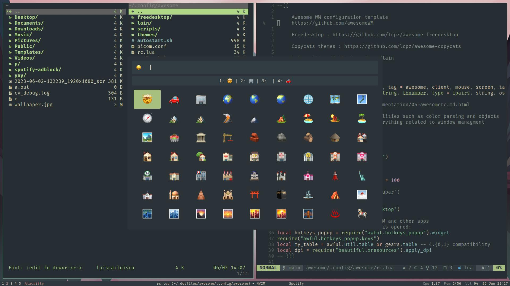

<!-- PROJECT LOGO -->
<p align="center">
  

  <h1 align="center">Personal dotfiles</h1>

  <p align="center">
    This repository contains my personal configuration files for Arch Linux with AwesomeWM, Alacritty, Fish Shell, Neovim, Rofi and Vifm. Feel free to use them as inspiration for your own setup.
  </p>
</p>



## Installation
1. Clone this repository
```bash
git clone https://github.com/luiisca/dotfiles.git ~/dotfiles
```
2. Install GNU Stow, a tool that creates symbolic links to the desired directories. You can use your preferred package manager or install it from source.
```bash
sudo pacman -S stow
```
3. Use Stow to create symbolic links to the directories that you want to use.
```bash
cd dotfiles
stow alacritty awesome fish nvim tmux picom rofi rofimoji vifm ...
```
4. Alternatively, you can manually copy the files to the appropriate locations in your home directory.

## Packages
| Name        | Link           |
| ------------- |-------------|
| awesome | [https://github.com/awesomeWM/awesome](https://github.com/awesomeWM/awesome) |
| nerd-fonts-complete-mono-glyphs | [https://aur.archlinux.org/packages/nerd-fonts-complete-mono-glyphs](https://aur.archlinux.org/packages/nerd-fonts-complete-mono-glyphs) |
| alacritty | [https://github.com/alacritty/alacritty](https://github.com/alacritty/alacritty) |
| neovim | [https://www.archlinux.org/packages/community/x86_64/neovim](https://www.archlinux.org/packages/community/x86_64/neovim) |
| vifm | [https://www.archlinux.org/packages/community/x86_64/vifm](https://www.archlinux.org/packages/community/x86_64/vifm) |
| fish | [https://github.com/fish-shell/fish-shell](https://github.com/fish-shell/fish-shell) |
| fisher | [https://github.com/jorgebucaran/fisher](https://github.com/jorgebucaran/fisher) |
| nvm.fish | [https://github.com/jorgebucaran/nvm.fish](https://github.com/jorgebucaran/nvm.fish) |
| starship | [https://github.com/starship/starship](https://github.com/starship/starship) |
| rofi | [https://github.com/davatorium/rofi](https://github.com/davatorium/rofi) |
| rofimoji | [https://github.com/fdw/rofimoji](https://github.com/fdw/rofimoji) |
| exa | [https://github.com/ogham/exa](https://github.com/ogham/exa) |
| prettierd | [https://github.com/fsouza/prettierd](https://github.com/fsouza/prettierd)


## References
Here are some useful resources that I used to learn more about the tools and technologies that I use in my dotfiles:

- [Nvim lua guide](https://github.com/nanotee/nvim-lua-guide): A comprehensive guide to using Lua in Neovim.
- [Nvim stable config](https://github.com/LunarVim/nvim-basic-ide): A simple but powerful Neovim configuration that provides a basic IDE-like experience with LSP, treesitter, telescope and more.
- [Learn Vimscript](https://learnvimscriptthehardway.stevelosh.com): A book that teaches you how to customize Vim by writing Vimscript code.

Here are some other dotfiles repositories that I found inspiring or helpful:

- [craftzdog's dotfiles](https://github.com/craftzdog/dotfiles-public): A beautiful and functional setup with AwesomeWM, Alacritty, Fish Shell and Neovim.
- [ThePrime's dotfiles](https://github.com/ThePrimeagen/.dotfiles): A minimalist and elegant setup with i3wm, Alacritty, Zsh and Neovim.
- [Oleksandr's dotfiles](https://gitlab.com/ejiqpep/nvim-config): A modern and modular Neovim configuration that uses Lua and plugins such as packer, nvim-lspconfig, nvim-treesitter and nvim-compe.
- [Mischavandenburg's dotfiles](https://github.com/mischavandenburg/dotfiles-everforest): A dark and cozy setup with AwesomeWM, Alacritty, Zsh and Neovim using the Everforest color scheme.
- [Arco awesome](https://github.com/arcolinuxd/arco-awesome): A ready-to-use AwesomeWM configuration that comes with Arco Linux, a distribution based on Arch Linux.
